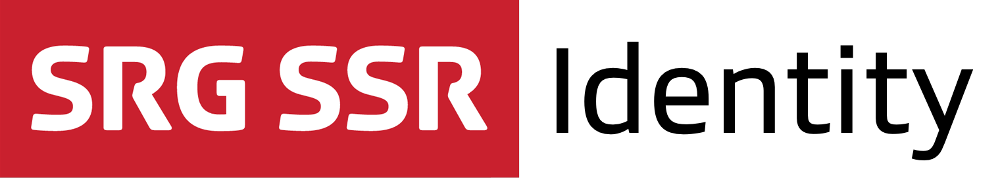

[](https://github.com/SRGSSR/srgidentity-ios/releases) [](https://github.com/SRGSSR/srgidentity-ios) [](https://travis-ci.org/SRGSSR/srgidentity-ios/branches) [](https://github.com/Carthage/Carthage) [](https://github.com/SRGSSR/srgidentity-ios/blob/master/LICENSE)

## About

The SRG Identity framework is a simple way to authenticate users within SRG SSR applications.

## Compatibility

The library is suitable for applications running on iOS 9 and above. The project is meant to be opened with the latest Xcode version.

## Contributing

If you want to contribute to the project, have a look at our [contributing guide](CONTRIBUTING.md).

## Installation

The library can be added to a project using [Carthage](https://github.com/Carthage/Carthage) by adding the following dependency to your `Cartfile`:
    
```
github "SRGSSR/srgidentity-ios"
```

For more information about Carthage and its use, refer to the [official documentation](https://github.com/Carthage/Carthage).

### Dependencies

The library requires the following frameworks to be added to any target requiring it:

* `FXReachability`: A reachability framework.
* `libextobjc`: An utility framework.
* `MAKVONotificationCenter`: A safe KVO framework.
* `Mantle`: The framework used to parse the data.
* `SRGIdentity`: The identity library framework.
* `SRGLogger`: The framework used for internal logging.
* `SRGNetwork`: A networking framework.
* `UICKeyChainStore`: The framework used to manage the keychain.

### Dynamic framework integration

1. Run `carthage update` to update the dependencies (which is equivalent to `carthage update --configuration Release`). 
2. Add the frameworks listed above and generated in the `Carthage/Build/iOS` folder to your target _Embedded binaries_.

If your target is building an application, a few more steps are required:

1. Add a _Run script_ build phase to your target, with `/usr/local/bin/carthage copy-frameworks` as command.
2. Add each of the required frameworks above as input file `$(SRCROOT)/Carthage/Build/iOS/FrameworkName.framework`.

### Static framework integration

1. Run `carthage update --configuration Release-static` to update the dependencies. 
2. Add the frameworks listed above and generated in the `Carthage/Build/iOS/Static` folder to the _Linked frameworks and libraries_ list of your target.
3. Also add any resource bundle `.bundle` found within the `.framework` folders to your target directly.
4. Add the `-all_load` flag to your target _Other linker flags_.

## Usage

When you want to use classes or functions provided by the library in your code, you must import it from your source files first.

### Usage from Objective-C source files

Import the global header file using:

```objective-c
#import <SRGIdentity/SRGIdentity.h>
```

or directly import the module itself:

```objective-c
@import SRGIdentity;
```

### Usage from Swift source files

Import the module where needed:

```swift
import SRGIdentity
```

### Working with the library

To learn about how the library can be used, have a look at the [getting started guide](GETTING_STARTED.md).

### Logging

The library internally uses the [SRG Logger](https://github.com/SRGSSR/srglogger-ios) library for logging, within the `ch.srgssr.mediaplayer` subsystem. This logger either automatically integrates with your own logger, or can be easily integrated with it. Refer to the SRG Logger documentation for more information.

## License

See the [LICENSE](../LICENSE) file for more information.
